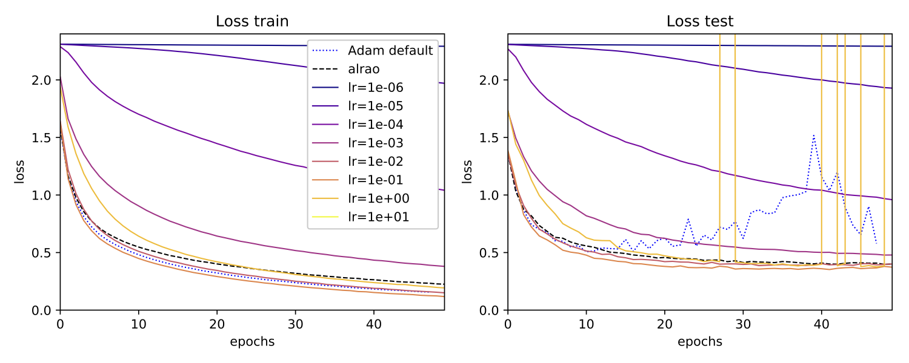
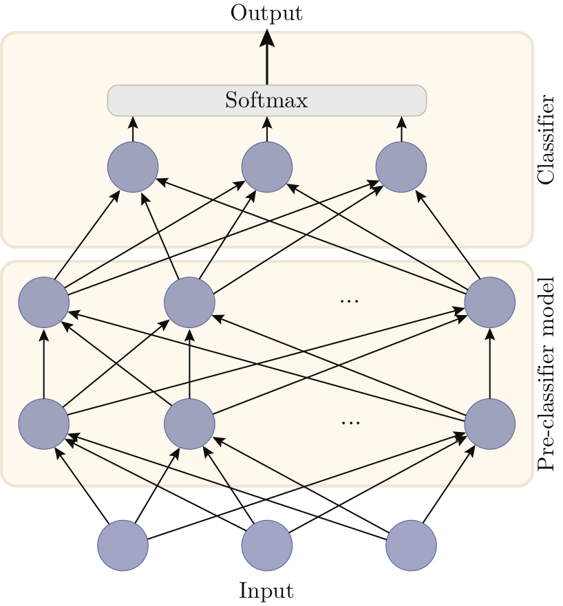
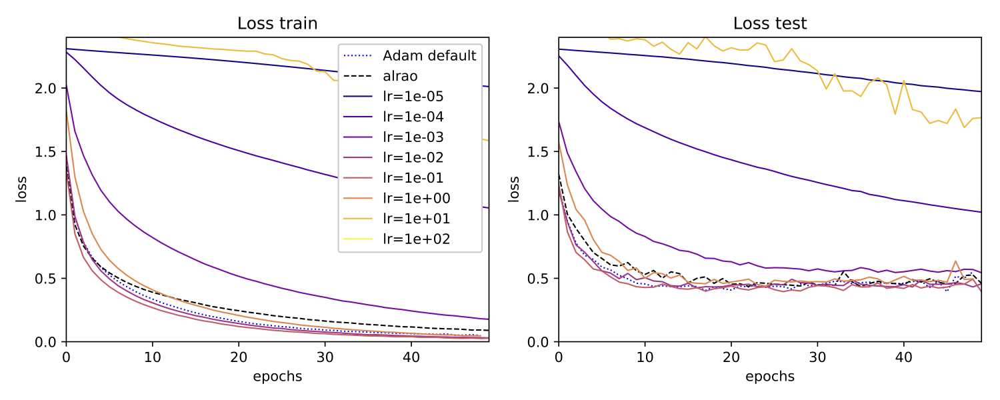
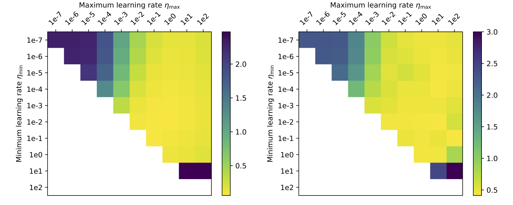

 

# Introduction

We propose *All Learning Rates At Once* (Alrao), an alteration of
standard optimization methods for deep learning models. Alrao uses
multiple learning rates at the same time in the same network. By
sampling one learning rate per feature, Alrao reaches performance close
to the performance of the optimal learning rate, without having to try
multiple learning rates. Alrao can be used on top of various
optimization algorithms; our experimental results are obtained
with Alrao on top of SGD.

<!-- {:height="50%" width="50%"} -->
*The MobileNet architecture is trained with several optimization method : usual SGD for several learning rates in the interval
$(10^{-5}, 100)$, Adam with its default hyperparameters, and Alrao with learning rates sampled in the interval $(10^{-5}, 100)$. We observe that by sampling randomly the learning rates in the model, the performance are close to the optimal learning rates.*

Alrao could be useful when testing architectures: an architecture could
first be trained with Alrao to obtain an approximation of the
performance it would have with an optimal learning rate. Then it would
be possible to select a subset of promising architectures based on
Alrao, and search for the best learning rate on those architectures,
fine-tuning with any optimizer.

The original paper can be found here: [arxiv:1810.01322](https://arxiv.org/abs/1810.01322).

Our Pytorch implementation is here : [github.com/leonardblier/alrao](https://github.com/leonardblier/alrao). It can be used
with a wide set of architecture. In particular, here is a link to our step-by-step tutorial on how to use Alrao : [github.com/leonardblier/alrao/tutorial.ipynb](https://github.com/leonardblier/alrao/blob/master/tutorial.ipynb)

## Motivation.

Alrao was inspired by the intuition that not all units in a neural
network end up being useful. Hopefully, in a large enough network, a
sub-network made of units with a good learning rate could learn well,
and hopefully the units with a wrong learning rate will just be ignored.
(Units with a too large learning rate may produce large activation
values, so this assumes the model has some form of protection against
those, such as BatchNorm or sigmoid/tanh activations.)

Several lines of work support the idea that not all units of a network
are useful or need to be trained, for example on *pruning* trained networks
[1, 2, 3, 4], or the *lottery ticket hypothesis* [5].

Viewing the per-feature learning rates of Alrao as part of the
initialization, this hypothesis suggests there might be enough
sub-networks whose initialization leads to good convergence.

# All Learning Rates At Once: Description

## Alrao: principle.

Alrao starts with a standard optimization method such as SGD, and a
range of possible learning rates $(\eta_{\min}, \eta_{\max})$. Instead
of using a single learning rate, we sample once and for all one learning
rate for each *feature*, randomly sampled log-uniformly in
$(\eta_{\min}, \eta_{\max})$. Then these learning rates are used in the
usual optimization update:

$$\theta_{l,i} \leftarrow \theta_{l,i} - \eta_{l,i} \cdot \nabla_{\theta_{l,i}}\ell(\Phi_\theta(x), y)$$

where $\theta_{l,i}$ is the set of parameters used to compute the
feature $i$ of layer $l$ from the activations of layer $l-1$ (the
*incoming* weights of feature $i$). Thus we build "slow-learning" and
"fast-learning" features, in the hope to get enough features in the
"Goldilocks zone".

What constitutes a *feature* depends on the type of layers in the model.
For example, in a fully connected layer, each component of a layer is
considered as a feature: all incoming weights of the same unit share the
same learning rate. On the other hand, in a convolutional layer we
consider each convolution filter as constituting a feature: there is one
learning rate per filter (or channel), thus keeping
translation-invariance over the input image.

However, the update cannot be used directly in the last
layer. For instance, for regression there may be only one output
feature. For classification, each feature in the final classification
layer represents a single category, and so using different learning
rates for these features would favor some categories during learning.
Instead, on the output layer we chose to duplicate the layer using
several learning rate values, and use a (Bayesian) model averaging
method to obtain the overall network output

## Definitions and notation.

We now describe Alrao more precisely for deep learning models with
softmax output, on classification tasks (the case of regression is
similar).

Let $$\mathcal{D} = \{(x_{1}, y_{1}), ..., (x_{N}, y_{N})\}$$, with $$y_{i}
\in \{1, ..., K\}$$, be a classification dataset. The goal is to predict
the $y_{i}$ given the $x_{i}$, using a deep learning model
$\Phi_{\theta}$. For each input $x$, $\Phi_{\theta}(x)$ is a probability
distribution over $$\{1, ..., K\}$$, and we want to minimize the
categorical cross-entropy loss $\ell$ over the dataset:

$$\frac{1}{N}\sum_{i}\ell(\Phi_{\theta}(x_{i}), y_{i}).$$

A deep learning model for classification $\Phi_{\theta}$ is made of two
parts: a *pre-classifier* $\phi_{\theta^{\text{pc}}}$ which computes
some quantities fed to a final *classifier layer*
$C_{\theta^{\text{c}}}$, namely,
$\Phi_{\theta}(x)=C_{\theta^{\text{cl}}}(\phi_{\theta^{\text{pc}}}(x))$.
The classifier layer $C_{\theta^{\text{c}}}$ with $K$ categories is
defined by $C_{\theta^{\text{c}}} = \text{softmax}\circ\left(W^{T}x +
b\right)$ with $\theta^{\text{cl}} = (W, b)$.The
*pre-classifier* is a computational graph composed of any number of
*layers*, and each layer is made of multiple *features*.

We denote $\log -U(\cdot ; \eta_{\min}, \eta_{\max})$ the *log-uniform*
probability distribution on an interval $(\eta_{\min}, \eta_{\max})$:
namely, if $\eta \sim \log -U(\cdot ; \eta_{\min},
\eta_{\max})$, then $\log \eta$ is uniformly distributed between $\log
\eta_{\min}$ and $\log \eta_{\max}$.

### Alrao for the pre-classifier: A random learning rate for each feature.

In the pre-classifier, for each feature $i$ in each layer $l$, a
learning rate $\eta_{l,i}$ is sampled from the probability distribution
$\log -U(.; \eta_{\min}, \eta_{\max})$, once and for all at the
beginning of training. Then the incoming parameters of each feature
in the preclassifier are updated in the usual way with this learning
rate.

### Alrao for the classifier layer: Model averaging from classifiers with different learning rates. {#sec:parall-class}

In the classifier layer, we build multiple clones of the original
classifier layer, set a different learning rate for each, and then use a
model averaging method from among them (see figure below). The averaged classifier and the
overall Alrao model are:

$$
  C^{\text{Alrao}}_{\theta^{\text{cl}}}(z) \mathrel{\mathop{:}}=
  \sum_{j=1}^{N_{\text{cl}}}a_{j} C_{\theta^{\text{cl}}_{j}}(z)
$$

$$
\Phi^{\text{Alrao}}_{\theta}(x) \mathrel{\mathop{:}}=
C^{\text{Alrao}}_{\theta^{\text{cl}}}(\phi_{\theta^{\text{pc}}}(x))
$$

where the $$C_{\theta^{\text{cl}}_{j}}$$   are copies of the original
classifier layer, with non-tied parameters, and
$$\theta^{\text{cl}} \mathrel{\mathop{:}}=(\theta^{\text{cl}}_{1}, ...,
\theta^{\text{cl}}_{N_{\text{cl}}})$$. The $a_{j}$ are the parameters
of the model averaging, and are such that for all $j$,
$0 \leq a_{j} \leq 1$, and $\sum_{j}a_{j} = 1$. These are not updated by
gradient descent, but via the switch model averaging method (see below).

{:height="45%" width="45%"}   {:height="45%" width="45%"}

*Left: a standard fully connected neural network for a classification task with three classes, made of a pre-classifier and a classifier layer.
Right: Alrao version of the same network. The single classifier layer is replaced with a set of parallel copies of the original classifier, averaged with a model averaging method. Each unit uses its own learning rate for its incoming weights (represented by different styles of arrows).*

For each classifier $$C_{\theta^{\text{cl}}_{j}}$$, we set a learning
rate $$\log \eta_{j} = \log \eta_{\min} +
\frac{j-1}{N_{\text{cl}}-1}\log(\eta_{\max}/ \eta_{\min})$$, so that
the classifiers' learning rates are log-uniformly spread on the interval
$$(\eta_{\min}, \eta_{\max})$$.

Thus, the original model $\Phi_{\theta}(x)$ leads to the Alrao model
$\Phi^{\text{Alrao}}_{\theta}(x)$$. Only the classifier layer is
modified, the pre-classifier architecture being unchanged.

### The Alrao update.
The updates for the pre-classifier, classifier, and model averaging weights are as follows.

-   The update rule for the pre-classifier is the usual SGD one, with
    per-feature learning rates. For each feature $i$ in each layer $l$,
    its incoming parameters are updated as:

    $$
      \theta_{l,i} \leftarrow \theta_{l,i} - \eta_{l,i} \cdot \nabla_{\theta_{l,i}}\ell(\Phi^{\text{Alrao}}_\theta(x), y)
    $$

-   The parameters $\theta^{\text{cl}}_j$ of each classifier clone $j$
    on the classifier layer are updated as if this classifier alone was
    the only output of the model:

    $$ \theta^{\text{cl}}_{j} \leftarrow \theta^{\text{cl}}_{j}  - \eta_{j} \cdot \nabla_{\theta^{\text{cl}}_{j}}\,\ell(C_{\theta^{\text{cl}}_{j}}(\phi_{\theta^{\text{pc}}}(x)), y)$$

    (still sharing the same pre-classifier
    $\phi_{\theta^{\text{pc}}}$). This ensures classifiers with low
    weights $a_j$ still learn, and is consistent with model averaging
    philosophy. Algorithmically this requires differentiating the loss
    $N_{\text{cl}}$ times with respect to the last layer (but no
    additional backpropagations through the preclassifier).

-   To set the weights $a_j$, several model averaging techniques are
    available, such as Bayesian Model Averaging. We
    decided to use the *Switch* model averaging [6], a
    Bayesian method which is both simple, principled and very responsive
    to changes in performance of the various models.

## Experiments

 Here we only present our results on image classification. Additional results on recurrent learning can be found in the paper.

We used the CIFAR10 dataset with GoogLeNet, MobileNet and VGG19 networks.
The Alrao learning rates were sampled log-uniformly from
$\eta_{\min} = 10^{-5}$ to $\eta_{\max} = 10$.
We compare these results to the same models trained with SGD for every learning rate in
the set $$\{10^{-5},10^{-4},10^{-3},10^{-2}, 10^{-1}, 1., 10.\}$$.
We also compare to Adam with its default
hyperparameters ($\eta=10^{-3}, \beta_1 = 0.9, \beta_2 = 0.999$).
More details on these experiments can be found in the paper.

Below are the learning curves

*MobileNet*

*GoogLeNet*

We can also look at the influence of the hyperparameters $\eta_\min$ and $\eta_\max$ on Alrao performance (See figure below).

*Performance of Alrao with a GoogLeNet model, depending on the interval
  $(\eta_\min, \eta_\max)$. Left: loss on the train set; right: on the
  test set. Each point with coordinates $(\eta_\min, \eta_\max)$ above
  the diagonal represents the loss after 30 epochs for Alrao with this
  interval. Points $(\eta, \eta)$ on the diagonal represent
  standard SGD
  with learning rate $\eta$ after 50 epochs. Standard SGD with $\eta = 10^2$ is
  left blank to due numerical divergence (NaN). Alrao works as soon as
  $(\eta_\min, \eta_\max)$ contains at least one suitable learning
  rate.*

  As expected, Alrao performs slightly worse than the best learning rate.
  Still, even with wide intervals $(\eta_\min, \eta_\max)$, Alrao comes
  reasonably close to the best learning rate, across all setups; hence
  Alrao's possible use as a quick assessment method. Although Adam with
  its default parameters almost matches optimal SGD, this is not always
  the case, for example with the MobileNet model. This confirms a known risk of
  overfit with Adam [7]. In our setup, Alrao seems to be
  a more stable default method.

## Conclusion

Applying stochastic gradient descent with random learning rates for
different features is surprisingly resilient in our experiments, and
provides performance close enough to SGD with an optimal learning rate,
as soon as the range of random learning rates contains a suitable one.
This could save time when testing deep learning models, opening the door
to more out-of-the-box uses of deep learning.

## References

[1] Y. LeCun, J. S. Denker, and S. A. Solla. Optimal brain damage. Advances in Neural Information Processing Systems 2, 1990

[2] S. Han, H. Mao, and W. J. Dally. Deep Compression: Compressing Deep Neural Networks with Pruning, Trained Quantization and Huffman Coding. arXiv preprint arXiv:1510.00149, 2015.

[3] S. Han, J. Pool, J. Tran, and W. J. Dally. Learning both Weights and Connections for Efficient Neural Networks. In Advances in Neural Information Processing Systems, 2015.

[4] A. See, M.-T. Luong, and C. D. Manning. Compression of Neural Machine Translation
Models via Pruning. arXiv preprint arXiv:1606.09274, 2016.

[5] J. Frankle and M. Carbin. The Lottery Ticket Hypothesis: Finding Small, Trainable Neural Networks. arXiv preprint arXiv:1704.04861, mar 2018.

[6] T. Van Erven, P. Grünwald, and S. De Rooij. Catching up faster by switching sooner: A predictive approach to adaptive estimation with an application to the AIC-BIC dilemma. Journal of the Royal Statistical Society: Series B , 2012.

[7] A. C. Wilson, R. Roelofs, M. Stern, N. Srebro, and B. Recht. The marginal value of adaptive gradient methods in machine learning. In Advances in Neural Information Processing Systems, 2017.
